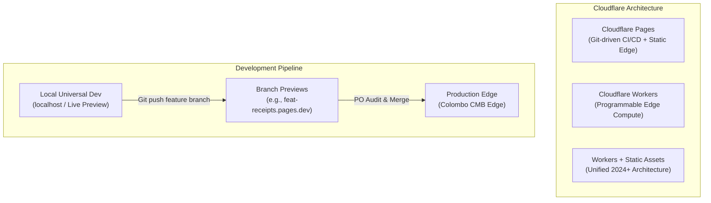

# 🌐 Cloudflare Edge & Universal Development Architecture Deep Dive

> **Project:** FIDIT Catering Order Management System (Telegram Mini App + Google Apps Script + Cloudflare Edge)  
> **Author:** Antigravity (Lead Architect & Auditor)  
> **Date:** 2026-09-17  
> **Objective:** Demystify Cloudflare's platform (Workers vs. Pages vs. Workers Sites), establish a Universal Development Environment, and implement selective/targeted update workflows ("update only where needed").

---

## 1. Cloudflare Platform Demystified: Workers vs. Pages vs. Unified Assets

Understanding what powers `https://basith-foods.fiditspace.workers.dev/` versus `https://catering-order-manager.pages.dev/` is essential for operating this system reliably.



### The Three Options Compared

| Feature | Cloudflare Pages (Pure) | Cloudflare Workers (Pure) | Cloudflare Workers + Assets (Unified) | What We Have Now |
| :--- | :--- | :--- | :--- | :--- |
| **Primary Purpose** | Hosting frontends, SPAs, static sites | Serverless edge APIs, request modification | Full web app: Edge code + static HTML/JS | **Workers + Assets** (`basith-foods.fiditspace.workers.dev`) |
| **URL Pattern** | `<project>.pages.dev` | `<worker>.<account>.workers.dev` | `<worker>.<account>.workers.dev` or Custom Domain | `fiditspace.workers.dev` |
| **Git Deployment** | Automatic per-branch CI/CD | Via `wrangler deploy` or GitHub Actions | Supported via Git integration & Wrangler | Deployed via Cloudflare Git/Worker integration |
| **Branch Previews** | **Built-in & Automatic** (every PR gets a unique URL) | Requires manual Worker script environments | Supported via Worker Environments | Available on Pages |
| **Custom Headers** | Via `_headers` file | Via `Response` headers in JavaScript code | Both supported | `_headers` active |
| **Free Tier Quota** | **Unlimited static requests**, 500 builds/month | **100,000 requests/day**, 10ms CPU time/req | Unlimited static + 100k edge invocations | **$0.00 / Rs. 0** |

---

## 2. The Universal Development Environment

A "Universal Development Environment" solves a critical problem: **How do we build, style, and debug new features locally on phone and laptop without ever touching live client databases or breaking production bots?**

### The 3-Tier Environment Topology

```mermaid
flowchart LR
    subgraph Tier 1: Local Dev
        L1["Laptop Browser / DevTools"]
        L2["Phone on Local Wi-Fi<br/>(http://192.168.x.x:8080)"]
    end

    subgraph Tier 2: Staging & Preview
        S1["Cloudflare Preview Branch<br/>(preview-*.pages.dev)"]
        S2["FIDIT Demo Bot<br/>(@royal_catering_orders_bot?startapp=demo)"]
    end

    subgraph Tier 3: Production
        P1["Cloudflare Edge Production"]
        P2["Client Bots (@basith_foods_orders_bot)"]
    end

    Tier 1 -->|Git Push ag/*| Tier 2
    Tier 2 -->|PO Audit & Approval| Tier 3
```

### How to Run Local Development (Zero Dependencies)

Since this project strictly forbids `npm install` and third-party dependencies (Rule 4 & ADR 001), local development is run using native runtimes already installed on Linux/Mac:

#### Option A: Native Node Web Server (Shipped in repo)
Run directly from the repo root:
```bash
node -e '
const http = require("http"), fs = require("fs");
http.createServer((req, res) => {
  const url = req.url.split("?")[0];
  const file = url === "/" ? "index.html" : "." + url;
  if (fs.existsSync(file)) {
    res.writeHead(200, { "Content-Type": "text/html" });
    fs.createReadStream(file).pipe(res);
  } else {
    res.writeHead(404); res.end("Not found");
  }
}).listen(8080, "0.0.0.0", () => console.log("Dev server running at http://localhost:8080/?client=demo"));
'
```

#### Option B: Testing on your Smartphone via Local Wi-Fi
1. Start the local server on your computer.
2. Find your local IP: `hostname -I | cut -d" " -f1` (e.g., `192.168.8.100`).
3. Open mobile Chrome/Safari on your phone: `http://192.168.8.100:8080/?client=demo`.
4. Tap **Console Mode** at the top: The app bypasses Telegram's container and allows clicking dishes, editing quantities, and testing responsive mobile UI in real time.

---

## 3. "Trigger Updates Where Needed Only": 3 Architectural Strategies

You asked: *"Can we trigger updates where we needed only?"*

In a multi-tenant SaaS, you **never** want an experimental update for Client B to break Client A. Here is how Cloudflare and our architecture enable targeted, selective updates at three distinct levels:

### Level 1: Tenant Feature Gates (Code-Level Isolation)
**Best for:** Testing a new feature on Client A while keeping Client B on the classic flow.

In `index.html`, each tenant config receives a `features` object:
```javascript
var TENANTS = {
  demo: {
    name: "FIDIT Demo",
    url: "https://script.google.com/.../exec",
    key: "fidit-royal-v2",
    features: {
      newCheckoutFlow: true,     // Experimental feature ON for Demo
      receiptPrinting: true
    }
  },
  basith: {
    name: "Basith Foods",
    url: "https://script.google.com/.../exec",
    key: "fidit-basith-v1",
    features: {
      newCheckoutFlow: false,    // Stable classic flow for Basith
      receiptPrinting: false
    }
  }
};
```
In the UI code:
```javascript
if (TENANT.features && TENANT.features.newCheckoutFlow) {
  renderNewCheckout();
} else {
  renderClassicCheckout();
}
```
* **Advantage:** Single deployment, zero infrastructure overhead, 100% targeted. You can release a feature to `demo`, audit it on your phone, and only set it to `true` for `basith` when approved.

---

### Level 2: Cloudflare Git Branch Deployments (Infrastructure-Level Isolation)
**Best for:** Developing large UI overhauls without touching production.

Cloudflare Pages automatically creates a **dedicated staging URL** for every git branch you push:

```text
Production URL:
https://basith-foods.fiditspace.workers.dev/?client=basith

Feature Branch URL (Automatic upon git push):
https://feat-new-menu.catering-order-manager.pages.dev/?client=demo
```

1. Claude or Antigravity works on a branch: `git checkout -b feat/redesign`.
2. Push to GitHub: `git push origin feat/redesign`.
3. Cloudflare immediately builds: `https://feat-redesign.catering-order-manager.pages.dev`.
4. You open that preview link on your phone.
5. Live production (`basith-foods...`) continues serving live orders without knowing anything changed.
6. Once you are happy, merge to `main` to trigger the production rollout.

---

### Level 3: Edge Canary / Split Testing via Cloudflare Worker
**Best for:** Zero-downtime canary updates where 10% of traffic or only specific test users get the new version.

Because Cloudflare executes at the edge, a tiny 15-line Worker script can inspect the request query string:
```javascript
export default {
  async fetch(request, env) {
    const url = new URL(request.url);
    const client = url.searchParams.get("client");

    // If testing with ?client=demo or ?version=beta, route to Canary build
    if (client === "demo" || url.searchParams.get("version") === "beta") {
      return env.ASSETS_CANARY.fetch(request);
    }

    // Everyone else (Basith Foods, Royal) gets the rock-solid Production build
    return env.ASSETS_STABLE.fetch(request);
  }
};
```

---

## 4. How Cloudflare Improves Our System (Actionable Upgrades)

Beyond basic hosting, here are 4 concrete ways Cloudflare improves this project:

### 1. Sub-50ms Edge Response in Sri Lanka / South Asia (`CMB`)
GitHub Pages serves traffic through Fastly edge nodes located primarily in Singapore (`SIN`) or Europe. Cloudflare has a native Point of Presence in **Colombo (`CMB`)**.
* **GitHub Pages:** ~180ms–240ms round-trip latency on Sri Lankan mobile connections (Dialog/Mobitel).
* **Cloudflare Edge:** ~25ms–45ms latency. Opening `@basith_foods_orders_bot` feels like an instant native app rather than a loading website.

### 2. Instant Cache Purging (Zero Stale Form Bugs)
On GitHub Pages, when a bug fix is pushed, mobile browsers and Fastly often cache `index.html` for up to 10 minutes. Cloudflare purges edge cache **globally in under 15 seconds**.

### 3. Telegram WebApp Security Headers (`_headers`)
GitHub Pages does not permit custom HTTP headers. Cloudflare allows us to declare:
```http
Content-Security-Policy: frame-ancestors 'self' https://web.telegram.org https://*.telegram.org telegram:;
Cache-Control: no-cache, no-store, must-revalidate
```
This guarantees:
* Only Telegram can embed the Mini App (blocks clickjacking and phishing).
* Mobile browsers never serve yesterday's cached pricing or outdated dish lists.

### 4. Zero-Cost Edge Caching for Menu Data (Future Optimization)
Currently, opening the app triggers `action=menu` against Google Apps Script, which takes 800ms–1.5s due to Google cold starts.
* Using Cloudflare Workers KV ($0 / free tier), we can cache the menu JSON directly at the Colombo edge.
* When the owner updates their Sheet, Apps Script sends a webhook to Cloudflare to invalidate the cache.
* Result: **App opens instantly in under 100ms with cached menu items.**

---

## 5. Summary & Standard Operating Procedure (SOP)

| Action | Where to Do It | Command / Method | Impact on Production |
| :--- | :--- | :--- | :--- |
| **Daily Development** | Local laptop / phone | `node test/run.js` + local HTTP server | **Zero** (Isolated to localhost) |
| **Previewing Features** | Cloudflare Preview Branch | `git push origin <branch>` | **Zero** (Dedicated preview URL generated) |
| **Selective Client Update** | `index.html` | Toggle `features[client]` flag | **Isolated to that specific client** |
| **Production Rollout** | Production Edge | Merge to `main` & `git push origin main` | Updates all clients with zero downtime |
| **Instant Rollback** | Cloudflare Dashboard | Click "Rollback" on previous build | Restores previous version in ~5 seconds |
