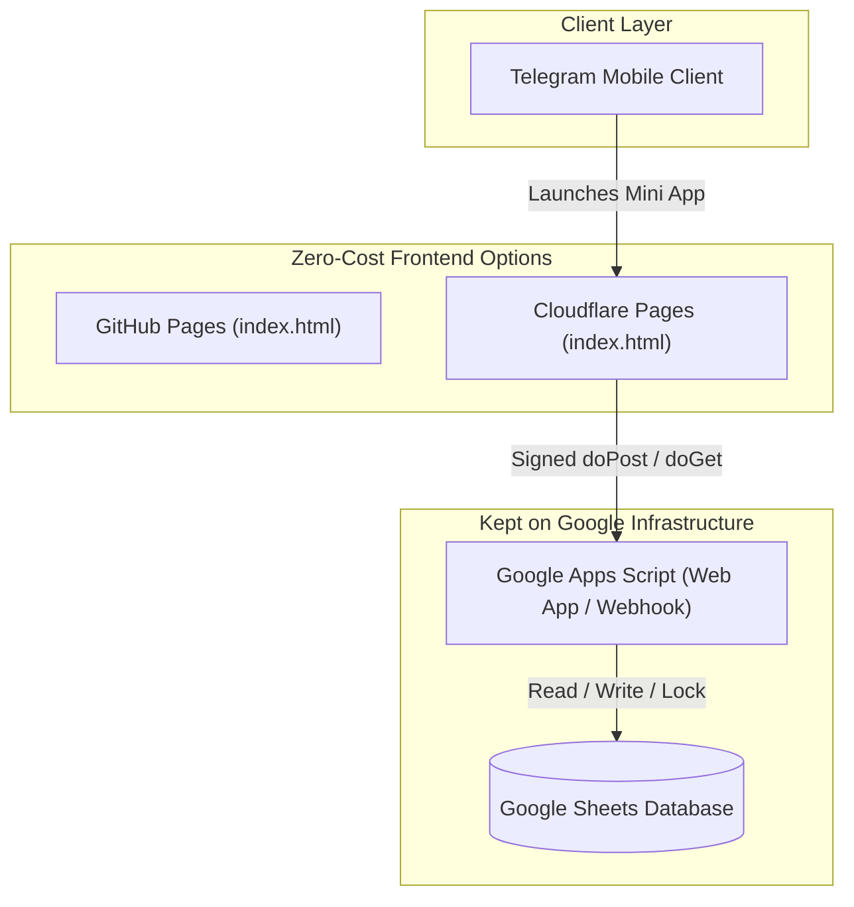

# 🌐 Cloudflare Pages Migration Research & Runbook

> **Author:** Antigravity (Lead Architect & Auditor)  
> **Date:** 2026-09-16  
> **Status:** Evaluated & Approved for Zero-Cost Production  
> **Deployment Model:** Hybrid (Cloudflare Pages Frontend + Google Apps Script Serverless Backend)

---

## 1. Executive Summary

This project can be hosted on **Cloudflare Pages** for **100% free (Rs. 0 / $0.00)**, satisfying the project's zero-cost constraint. For a mobile Telegram Mini App served to users in South Asia (Sri Lanka / India), Cloudflare Pages is technically superior to GitHub Pages in mobile edge latency, instant cache invalidation, and custom HTTP response header controls.

Because Cloudflare Pages connects directly to the GitHub repository (`fidit-space/catering-order-manager`), it can run **in parallel with GitHub Pages** without code divergence.

---

## 2. Architecture: What Moves vs. What Stays



### Layer 1: Frontend (`index.html`) → Deploy to Cloudflare Pages
- **Cost:** $0.00 / Rs. 0 (Unlimited bandwidth, unlimited static requests, 500 builds/month).
- **Zero code changes:** `index.html` requires no build step and runs identically.
- **Edge performance:** Cloudflare has 330+ edge locations (including Colombo `CMB`, Chennai, Mumbai) compared to Fastly CDN on GitHub Pages.
- **Cache control:** Deploys purge global edge cache instantly (vs. GitHub Pages 10-minute cache delay).
- **HTTP Headers:** Supports custom `_headers` for `Cache-Control` and `Content-Security-Policy` (`frame-ancestors`).

### Layers 2 & 3: Backend & Database (`backend/google_apps_script.js` + Google Sheets) → Retain on Google
- **Why keep Google Apps Script + Sheets?**
  1. The business owner must be able to edit the `Menu` tab (dishes, rates, portion step sizes) directly from the Google Sheets smartphone app with no developer assistance.
  2. Google Apps Script provides native spreadsheet locking, background cron triggers (15-min dispatch alerts, evening prep digests, weekly CSV backups), and Telegram webhook routing.
  3. Migrating backend logic to Cloudflare Workers + D1 (SQLite) would destroy mobile spreadsheet editing and require engineering a custom admin CMS.

---

## 3. Comparison Matrix

| Feature | GitHub Pages (Current) | Cloudflare Pages (Free Tier) | Operational Impact |
| :--- | :--- | :--- | :--- |
| **Hosting Cost** | **$0.00 / Rs. 0** | **$0.00 / Rs. 0** | Meets zero-cost mandate. |
| **Bandwidth** | 100 GB/mo soft limit | **Unlimited** | No risk of throttling during festive surges. |
| **Edge Locations** | Standard CDN | **330+ cities (CMB, MAA, BOM)** | Faster initial load on mobile networks in South Asia. |
| **Cache Purge** | Up to 10 min delay | **Instant (~15 sec)** | Bug fixes reach client phones immediately. |
| **HTTP Headers** | Not supported | Supported via `_headers` | Prevents stale form caches & secures iframe framing. |
| **Custom Domains** | Basic CNAME | Apex CNAME flattening + Auto SSL | Clean branded domains (e.g., `orders.fidit.space`). |
| **Build & Deploy Time** | 1–3 mins (GitHub Actions) | **15–30 seconds** | Rapid deployment cycle. |
| **Web Analytics** | None | Free privacy-first analytics | Track visitor traffic without cookies or trackers. |

---

## 4. Multi-Tenant Compatibility

The multi-tenant routing engine in `index.html` resolves tenant configuration via query parameters:
```text
https://catering-order-manager.pages.dev/?client=royal
```

To route a tenant to Cloudflare:
1. **Bot Menu Button:** Update BotFather menu button URL to the Cloudflare Pages URL.
2. **Script Properties:** Update `MINI_APP_URL` in the client's Google Apps Script to the Cloudflare URL so receipt links point to the new domain.

---

## 5. Deployment Step-by-Step

1. Log in to the [Cloudflare Dashboard](https://dash.cloudflare.com/).
2. Navigate to **Workers & Pages** → **Create application** → **Pages** → **Connect to Git**.
3. Authorize access to `fidit-space/catering-order-manager`.
4. Configure build settings:
   - **Project name:** `catering-order-manager`
   - **Production branch:** `main`
   - **Framework preset:** `None`
   - **Build command:** *(Leave completely empty)*
   - **Build output directory:** `/` *(Root directory)*
5. Click **Save and Deploy**.
6. (Optional) Under **Custom domains**, map a branded subdomain (e.g. `orders.fidit.space`).

---

## 6. HTTP Headers Specification (`_headers`)

To prevent mobile browsers from serving stale orders and to allow Telegram WebApp embedding:

```http
/*
  X-Content-Type-Options: nosniff
  Referrer-Policy: strict-origin-when-cross-origin
  Content-Security-Policy: frame-ancestors 'self' https://web.telegram.org https://*.telegram.org telegram:;

/
  Cache-Control: no-cache, no-store, must-revalidate

/index.html
  Cache-Control: no-cache, no-store, must-revalidate
```
