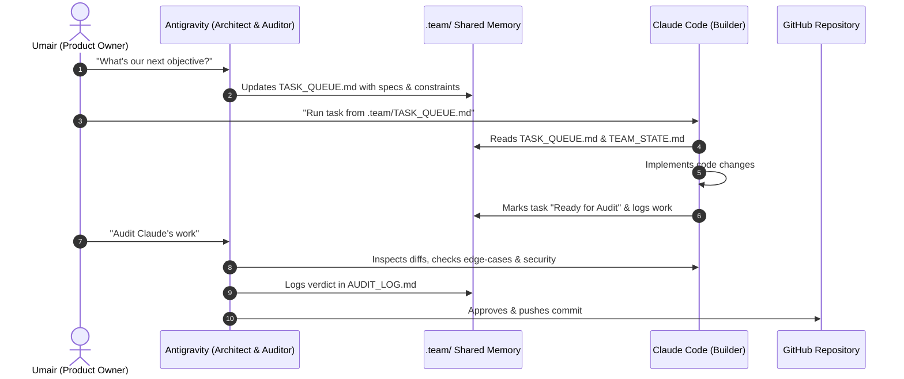

# 🧠 TEAM WORKSPACE STATE & SHARED MEMORY

> **Project:** Mobile Catering Order Management System (Telegram Mini App + Google Apps Script + Sheets)  
> **Client:** Client #1 (Pilot: Friend's Catering Business) → FIDIT White-label SaaS  
> **Repository:** `fidit-space/catering-order-manager` (Private)  
> **Last Synchronized:** 2026-09-08  

---

## 👥 The Team Roles & Protocols

| Role | Entity | Primary Responsibility |
|---|---|---|
| **Product Owner** | **Umair (FIDIT)** | Business goals, client relations, credential management, approving merges |
| **Lead Architect & Auditor** | **Antigravity** | Security audits, architectural boundaries, edge-case detection, verification |
| **Full-Stack Implementer** | **Claude Code** | Heavy coding, file refactoring, UI styling, test scripting |

---

## 🔄 Dual-Agent Collaboration Protocol

---

## 📌 Active Architecture Baseline

1. **Frontend:** `index.html` — Vanilla JS + CSS, Telegram WebApp SDK, runs on GitHub Pages (`$0/month`).
2. **Backend:** `backend/google_apps_script.js` — Standalone Google Apps Script on FIDIT's Drive, connects to client Sheet via `SPREADSHEET_ID`.
3. **Database:** Google Sheets (`Menu`, `Orders`, `Customers`, `Log` tabs).
4. **Notifications:** Telegram Bot API (instant alerts with Call/WhatsApp buttons + 15m/daily cron triggers).

---

## 🔑 Security & IP Policy (Strictly Enforced)

1. **No Credentials in Git:** Bot tokens, Chat IDs, and API keys reside exclusively in Google Apps Script **Script Properties**.
2. **Standalone Backend:** The Apps Script must NEVER be container-bound to the client's Google Sheet. It connects via `SpreadsheetApp.openById()` so the client can never view the backend code under `Extensions > Apps Script`.
3. **Concurrency Locks:** Any write to the Sheet must acquire `LockService.getScriptLock()` with a 20s timeout.
