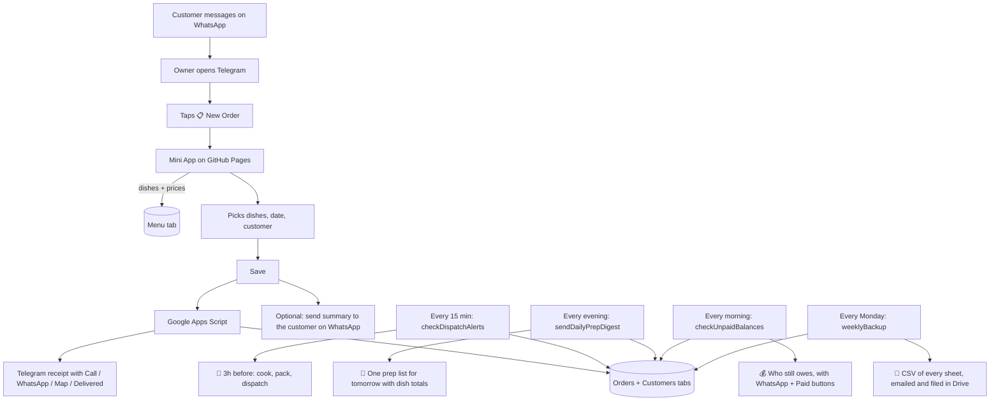

# 🍲 Mobile Catering Order Manager

A zero-cost order book, customer database and reminder system for a catering business
run entirely from a smartphone — no laptop, no monthly fees, no server to maintain.

Runs as a **Telegram Mini App** on **GitHub Pages**, backed by **Google Sheets** and
**Google Apps Script**.

> **Setting it up?** → **[SETUP_INSTRUCTIONS.md](SETUP_INSTRUCTIONS.md)**
> **Changing dishes or prices?** → **[MENU_GUIDE.md](MENU_GUIDE.md)**

---

## The problem it solves

| Problem | How this solves it |
| :--- | :--- |
| No computer — only a phone | Runs inside Telegram, which is already installed |
| Orders buried in WhatsApp chat history | Structured order form; every order in one sheet |
| "What am I cooking tomorrow?" | One evening message with **totals added up across all orders** |
| Forgetting a delivery | Urgent alert ~3 hours before each drop-off |
| Re-typing regulars' details | Type the phone number, the name and address fill themselves |
| Doing totals in your head | Prices live in the sheet; total and balance calculate as you tap |
| Customers disputing quantities | One tap sends the order summary to the customer on WhatsApp |
| Chasing money owed | Delivered orders that still owe are chased automatically, once |
| Losing everything with the account | A full CSV backup is emailed every week |
| Changing the menu | Edit a Google Sheet tab — no code, no deploy |
| Hosting costs | **Rs. 0** — GitHub Pages + Google's free quotas |

---

## How it works

---

## What is in this repo

| File | What it is |
| :--- | :--- |
| `index.html` | The whole Mini App — single file, vanilla JS, no build step |
| `backend/google_apps_script.js` | The serverless backend, pasted into Apps Script |
| `SETUP_INSTRUCTIONS.md` | One-time setup, step by step |
| `MENU_GUIDE.md` | How the owner changes dishes and prices himself |
| `CLAUDE_CODE_SPEC.md` | The original build specification |
| `Catering Order Management Solutions.md` | The research that led to this architecture |

---

## Daily use, on the phone

**Booking an order** — open the bot, tap **📋 New Order**, tap dishes (or tap the
quantity and type it), pick Today/Tomorrow, type the phone number (regulars fill in
automatically), tap **SAVE ORDER**. Offer to WhatsApp the summary to the customer so
the quantities are confirmed in writing.

**Seeing the day** — the **📅 Orders** tab lists Today / Tomorrow / Upcoming / Unpaid with
the money still to collect. Each order shows its stage and one button for the next step:
Confirm → Start cooking → Out for delivery → Delivered. Or just send `/today` to the bot.

**Getting paid** — every order carries its balance. Once it is delivered and still unpaid,
the bot chases it after three days with a WhatsApp button per customer and a *Paid* button
that clears the balance. `/money` shows everything outstanding at any time.

**Reminders arrive on their own** — a prep list every evening for tomorrow, and an
urgent alert about 3 hours before each delivery.

**If the signal drops** — the order is saved on the phone and sent automatically as
soon as you are back online. It is never silently lost.

**Every Monday** — a CSV copy of every sheet is emailed and filed in Google Drive, so the
business is never one lost account away from losing its order history.

---

## Data model

| Sheet tab | Contents |
| :--- | :--- |
| **Menu** | Category, Item, Unit, Rate, Step, Active — *the owner edits this one* |
| **Settings** | Alert timings, payment-chase delay, backup target — *also owner-editable* |
| **Orders** | Every order plus reminder, delivery and payment bookkeeping |
| **Customers** | Phone-keyed directory built automatically: name, last address, order count |
| **Log** | Every error, so nothing ever fails invisibly |

Secrets (bot token, chat id, API key) live in Apps Script **Script Properties** — never
in this repository.

---

## Reference: open-source projects researched

1. **[yuzefovichalex/tma-cafe](https://github.com/yuzefovichalex/tma-cafe)** — complete Telegram Mini App for cafe menus.
2. **[ZiyovuddinTolipov/lotos-telegeram-mini-app](https://github.com/ZiyovuddinTolipov/lotos-telegeram-mini-app)** — categorised food ordering Mini App.
3. **[kiran-venugopal/tgcart-mini-app](https://github.com/kiran-venugopal/tgcart-mini-app)** — Telegram contest-winning cart app.
4. **[Guf-Hub/TGBot](https://github.com/Guf-Hub/TGBot)** — Apps Script library binding the Telegram Bot API to Sheets.

---

## If you ever outgrow this

`Catering Order Management Solutions.md` compares this build against **Take App** and
**Kyte POS**. Move to one of those when you need staff accounts, stock control or
customers browsing and ordering by themselves. Until then this costs nothing and the
data stays in a spreadsheet you own.
